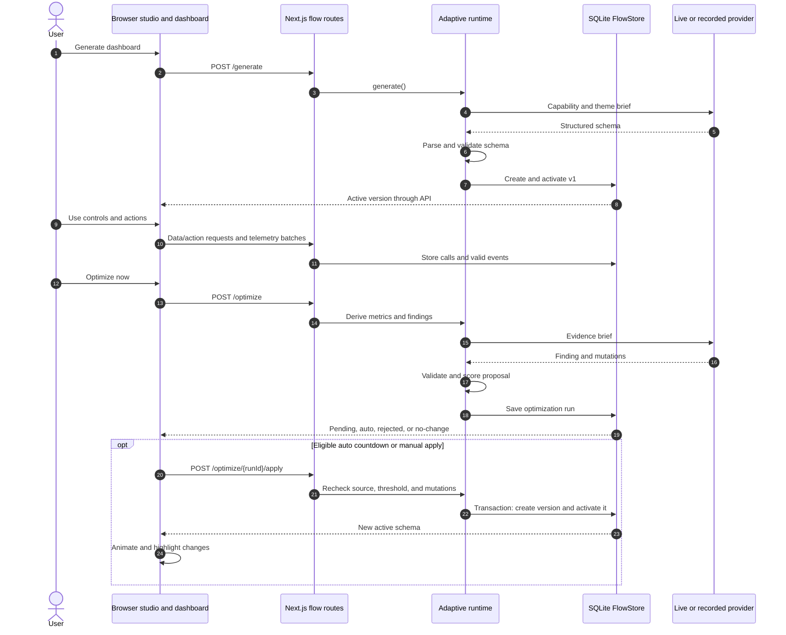
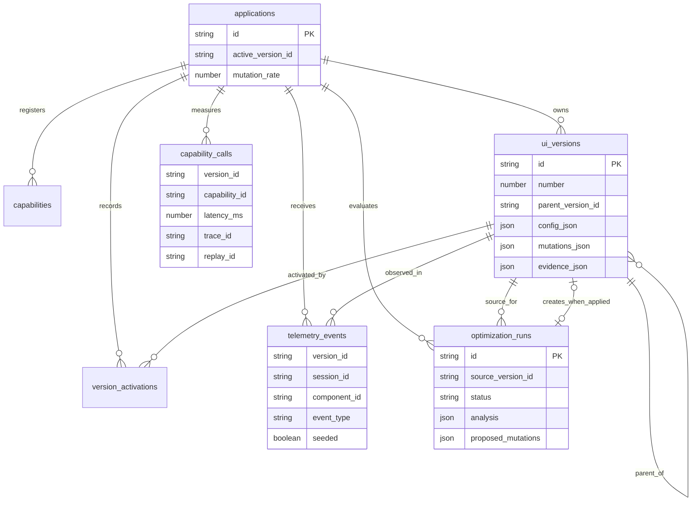

# flow.js architecture

This document describes the implemented repository, rather than the broader product vision in [product-spec.md](product-spec.md). flow.js is a local adaptive dashboard demo: an application registers data, actions, state, context, and theme; the runtime generates a declarative UI, observes its use, proposes constrained changes, and stores each accepted layout as an immutable version.

## System at a glance

The pnpm workspace has two packages. The repository root, `@flowjs/core`, supplies the capability model, adaptive runtime, SQLite store, reusable server adapter, API client, renderer, and studio. `apps/demo`, `@flowjs/demo`, is the Next.js 16 application that wires in the Northwind sales capabilities and exposes the UI and HTTP routes. It imports core through workspace package exports and transpiles it in `next.config.ts`.

```mermaid
flowchart LR
    subgraph Browser
        Studio[FlowStudio<br/>user and developer views]
        Renderer[Dashboard and known primitives]
        Tracker[Semantic telemetry tracker]
        Studio --> Renderer
        Renderer --> Tracker
    end
    subgraph Demo[Next.js demo process]
        Routes[App Router<br/>/api/flow/*]
        Bootstrap[getRuntime()<br/>one instance per process]
        Runtime[Core adaptive runtime]
        Registry[Sales capability registry<br/>server functions]
        Store[FlowStore]
        Routes --> Bootstrap --> Runtime
        Runtime --> Registry
        Runtime --> Store
    end
    DB[(Local SQLite<br/>.flow/flow.db)]
    AI[OpenAI Responses API<br/>optional live provider]
    Recording[Recorded sales responses]
    Sentry[Sentry traces, logs,<br/>Session Replay]
    Studio <-->|JSON requests| Routes
    Renderer -->|data and action requests| Routes
    Tracker -->|batched events| Routes
    Store --> DB
    Runtime -->|structured briefs| AI
    Runtime --> Recording
    Routes -.->|capability spans and logs| Sentry
    Browser -.->|browser tracing and replay| Sentry
```

There is no separate worker, queue, shared cache, authentication service, or deployment definition in this repository. The active dashboard is global to the demo application, while each browser page load has its own interaction session.

## Package and module boundaries

| Area | Main files | Responsibility |
| --- | --- | --- |
| Demo entry points | `apps/demo/src/app/page.tsx`, `developer/page.tsx`, `api/flow/**/route.ts` | Serve the user view at `/`, the developer console at `/developer`, and JSON route handlers. |
| Demo composition | `apps/demo/src/server/flow.ts`, `capabilities.ts` | Build one runtime per Node process; connect sales registration, SQLite, and AI providers. |
| Demo domain | `apps/demo/src/demo/sales-app.ts`, `sales-data.ts`, `recordings.ts` | Define Northwind capabilities, fictional backend behavior, and hand-authored recorded AI responses. `operations-app.ts` is another registry exercised by tests, not the running app. |
| Core model | `src/flow/registry.ts`, `data-contracts.ts`, `primitives.ts`, `schema.ts` | Normalize capability descriptors, validate data and UI schemas, and constrain which primitives can render each capability. |
| Core adaptation | `src/flow/runtime.ts`, `metrics.ts`, `friction.ts`, `mutations.ts`, `scoring.ts`, `ai/` | Run generation and optimization, derive evidence, validate proposed changes, score them, and apply eligible changes. |
| Persistence | `src/flow/store.ts` | Initialize SQLite, store telemetry and proposals, create immutable UI versions, and log activations. |
| Server capability boundary | `src/server/capabilities.ts`, `http.ts` | Validate requests, execute registered server functions, record latency and Sentry trace IDs, and return uniform JSON errors. |
| Browser | `src/client/`, `src/components/renderer/`, `src/components/studio/` | Call the API, render schema-bound controls, collect semantic events, animate changes, and show evidence and history. |

### Library boundary: current state and target

The dependency direction is mostly right: the demo imports `@flowjs/core`, and `src/flow/` does not import the sales demo. The model, schema validation, mutation engine, scoring, metrics, friction heuristics, and runtime accept application capabilities through `createFlowApp` and `createRuntime`. `operations-app.ts` exercises that generic path with a second registry in tests.

`@flowjs/core` is **a workspace package, not yet a standalone installable infrastructure library**. Its root `package.json` has `private: true` and export entries that point directly to `.ts` and `.tsx` source; the demo compensates with Next.js `transpilePackages`. There is no library build, declaration output, distributable CSS, or test that installs a packed artifact into an independent consumer. A consumer using another build setup cannot assume those source exports will work.

Several adapters also remain inside core. `src/server/http.ts` imports `next/server`; `src/server/capabilities.ts` and `src/client/telemetry.ts` import `@sentry/nextjs`. The API client and tracker hardcode `/api/flow`, while `GeneratePrompt.tsx` names `apps/demo/src/demo/sales-app.ts`. The studio relies on styles in `apps/demo/src/app/globals.css`. These are integration and demo concerns, not requirements of the adaptive model itself.

A clean distributable boundary would keep registry, schema, runtime, mutation, scoring, metrics, and provider interfaces in a framework-independent core package; make SQLite, OpenAI, Next.js routes, and Sentry optional server or framework adapters; and expose the React renderer with its own styles and a configurable transport. The demo would supply its sales registry, recorded responses, route mounting, observability configuration, and page chrome. A build producing JavaScript and type declarations, followed by a packed-package smoke test in a separate app, would prove that boundary. Until then, another Next.js app in this workspace can reuse substantial code, but external installation requires additional packaging and adapter work.

### Capabilities and UI schema

`createFlowApp` accepts three capability kinds: **data** (`fetch` plus a declared timeseries or collection output), **action** (`execute` plus input definitions), and **state** (enum, date range, or text values). Registration validates IDs, input sources, and state dependencies. It produces serializable descriptors and a dependency graph, while executable functions remain on the server. Dependent state is considered required by default; actions are required by default.

The active UI is a `UISchema` containing components with a stable ID, capability ID, primitive, size, order, visibility, and optional group. The renderer knows a fixed set of primitives: metric card, line or bar chart, table, list, button, button group, dropdown, segmented control, and search field. Sizes span 3, 6, 9, or 12 columns of a 12-column grid. A schema must bind every registered capability at least once, use a compatible primitive, and keep a visible component for every required capability. Schema normalization makes order indices dense.

```mermaid
flowchart LR
    Dev[Developer registration<br/>sales-app.ts] --> Reg[createFlowApp<br/>descriptors and dependency graph]
    Reg --> Brief[Generation brief<br/>descriptions, contracts, theme, grid]
    Brief --> Provider[Live or recorded AI provider]
    Provider --> Output[Structured schema proposal]
    Output --> Guard[Zod parse and validateSchema]
    Guard -->|valid| Version[Immutable UI version]
    Guard -->|invalid live output| Fallback[Recorded response validation]
    Fallback --> Version
    Version --> Render[Known renderer primitives]
    Reg -->|server functions only| Exec[Capability execution]
    Render -->|capability IDs, state, input| Exec
```



The Northwind demo registers revenue, orders, customers, and transactions as data; export and refund as actions; and date range and customer search as state. The dependency graph tells the client which data to refetch when state changes. The browser's `RendererProvider` keeps state and row selections in React, deduplicates in-flight data requests by capability and dependency values, and invalidates its cache after an action. Primitives call this provider rather than the API directly.

## HTTP contract and request paths

All flow routes live under `/api/flow`. The browser client in `src/client/api.ts` calls them; `handle` in `src/server/http.ts` translates runtime, input, and Zod errors into JSON responses. Each route obtains the lazily initialized `getRuntime()` instance. Its first construction opens SQLite and synchronizes the registered app descriptors.

| Method and path | Role |
| --- | --- |
| `GET /state` | Return application settings, serializable capability descriptors, dependency edges, default state, active version, version summaries, AI/Sentry status, and registration source. |
| `POST /generate` | Generate v1 if no active version exists; with `userRequest`, create a new customized version from a validated generated schema. |
| `POST /data/[capability]` | Fetch a registered data capability for supplied state and context; validate the declared data output. |
| `POST /actions/[capability]` | Execute a registered action with validated input and state. |
| `POST /telemetry` | Accept up to 500 semantic events per batch; reject events without a real version and component. |
| `GET /metrics` | Compute metrics and friction findings for the active version. |
| `POST /optimize` | Analyze evidence and save a proposal or diagnosis; does not change the active UI. |
| `POST /optimize/[runId]/apply` | Revalidate a pending or auto proposal and create an active version; accepts `auto` or `manual` mode. |
| `PATCH /settings` | Persist the mutation rate. |
| `POST /versions/undo`, `POST /versions/[versionId]/restore` | Activate an existing version and log the activation. |
| `POST`, `DELETE /telemetry/seed` | Add or remove flagged synthetic demo sessions. |

For data and action requests, the client sends state, session ID, version ID, component ID, and optional replay ID. `runCapability` checks the capability kind, calls only registered functions, measures elapsed time, and stores success or failure with the optional Sentry trace ID. Data outputs are checked against `TimeseriesData` or `CollectionData`. The demo's export action returns file content that the browser turns into a download; refund changes in-memory fictional backend state.

## Adaptive lifecycle

1. **Generate.** The provider receives a brief containing capability descriptions and contracts, compatible primitives, dependencies, theme, and grid rules. OpenAI uses the Responses API with Zod structured outputs. The runtime independently validates the result before creating v1. Calling generation again with no user request returns the active version; a customization request creates a new generated version with the current version as parent.
2. **Observe.** The dashboard records first view, hover, focus, scroll, disabled interaction, click, value change, action start, completion, and error. The tracker assigns one session ID per page load and resets time-since-shown when the active UI version changes. It flushes batches about every 1.5 seconds and on page hide. Telemetry is best effort. The server checks event shape and version/component membership, and derives the capability ID from the stored schema.
3. **Analyze.** `computeMetrics` derives component use, discovery and view time, repeat rate, interaction sequences, errors, and capability latency from persisted events and calls. `findFriction` evaluates buried controls, separated controls, poor primitives, oversized low-use components, and repeatedly retried actions. Retry findings use backend latency to classify interface friction versus performance friction. Metrics are calculated on request, not stored as aggregates.
4. **Propose.** Optimization requires at least one interaction. The AI brief includes the current schema, sample size (live and seeded sessions separately), component metrics, transitions, backend latency, and heuristic findings. The provider returns one finding, evidence, confidence, expected benefit, and zero or more structured mutations. A zero-mutation result is saved as `no-change`; invalid mutations are saved as `rejected` with errors.
5. **Score and apply.** Valid proposals get a score from expected benefit, confidence, evidence volume, mutation disruption, and recent activation penalty. Mutation rate `0` disables automatic apply; otherwise the threshold is `0.9 − 0.7 × mutationRate`. Runs above threshold are marked `auto`, others `pending`. In the developer UI, an auto run has a three-second countdown that can be cancelled; a pending run can be applied manually. The apply route checks that the proposal's source version is still active, rechecks the current auto threshold when applicable, reapplies and validates mutations, then creates and activates a version in one SQLite transaction. A changed source version marks the run `stale`.
6. **Review history.** The browser animates layout changes with Motion and highlights changed components. Undo activates the current version's parent; restore activates any stored version. Later changes can branch from the restored version. Neither action rewrites past versions.



The mutation vocabulary is `MOVE`, `REORDER`, `RESIZE`, `SWAP_VARIANT`, `SHOW`, and `HIDE`, with at most six operations per proposal. The mutation engine rejects unknown targets, incompatible variants, no-op changes, and removal of the only visible component for a required capability. It validates the complete resulting schema before persistence. The AI supplies proposals and explanations; it never supplies executable browser code or directly writes a layout.

## Persistence and version model

`FlowStore` uses Node 24's built-in `node:sqlite` with WAL and foreign keys enabled. It creates tables on first open. The default database path is `.flow/flow.db` relative to the demo process working directory (`apps/demo/.flow/flow.db` when started through the root scripts); `FLOW_DB_PATH` overrides it.



`applications` holds the current version pointer and mutation rate; `capabilities` holds synchronized descriptors. `ui_versions` stores complete schemas, parent links, mutations, reason, evidence, AI source, and optional telemetry snapshot. SQLite triggers reject updates and deletes to that table. `version_activations` logs generate, optimize, undo, and restore. `telemetry_events` and `capability_calls` hold observations; `optimization_runs` holds proposals, scores, statuses, and applied-version references. Version creation and activation are transactional. An optimization's evidence snapshot is attached to its resulting version, while live metrics continue to be derived from event rows.

## AI and observability boundaries

`src/flow/ai/briefs.ts` builds compact, serializable briefs; `contracts.ts` defines structured output shapes; `providers.ts` implements live OpenAI and recorded providers. A configured live call is tried first. If it fails or its structured output fails the runtime's check, the runtime validates and uses the recorded sales response, recording its source and fallback reason. `FLOW_AI_MODE=recorded` forces that path. **With no API key and without recorded mode, generation and optimization return 503** in the current implementation; existing versions can still be read and used. This differs from the README's statement that an unconfigured install runs the full loop automatically.

Sentry is optional. `apps/demo/src/instrumentation.ts` initializes server tracing and logs from `SENTRY_DSN`; `instrumentation-client.ts` initializes browser tracing and masked Session Replay from `NEXT_PUBLIC_SENTRY_DSN`. Capability spans include capability, component, version, session, and replay IDs. The local call record pairs measured latency with a trace ID when Sentry is enabled; telemetry metadata can carry a replay ID. Evidence can link traces when `NEXT_PUBLIC_SENTRY_ORG` is configured. Local latency measurement and friction analysis still run when Sentry is off.

## Operational scope and verification

This is a single-process, local demo with fictional sales data and simulated latency. The refund set is in memory and resets with the process; SQLite retains UI versions, telemetry, and optimization runs. Seeded sessions are explicitly flagged and removable. There is no per-user dashboard configuration, access control, multi-instance coordination, backup policy, or production hosting setup. The `userId` telemetry field exists, but the demo does not implement identity or personalization.

Use Node 24 or later and pnpm. From the root, `pnpm dev` starts the demo; `pnpm test`, `pnpm --dir apps/demo test`, `pnpm typecheck`, `pnpm --dir apps/demo typecheck`, `pnpm build`, and `pnpm test:e2e` cover its code paths. `pnpm db:reset` clears the local SQLite file. Environment variables are listed in `apps/demo/.env.example`.
